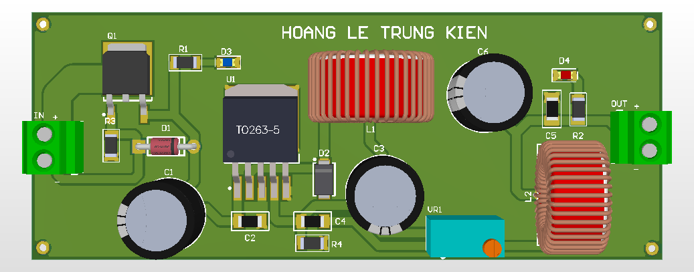

# LM2596S Buck Converter

Step-down DC-DC converter.

## Function
Efficient voltage regulation.

## Key Specifications
- Topology: Buck
- Feedback: Adjustable
- Capacitors: 1000uF / 470uF
- Indicator: LED

## Hardware Preview

---
Designed by HOANG LE TRUNG KIEN
